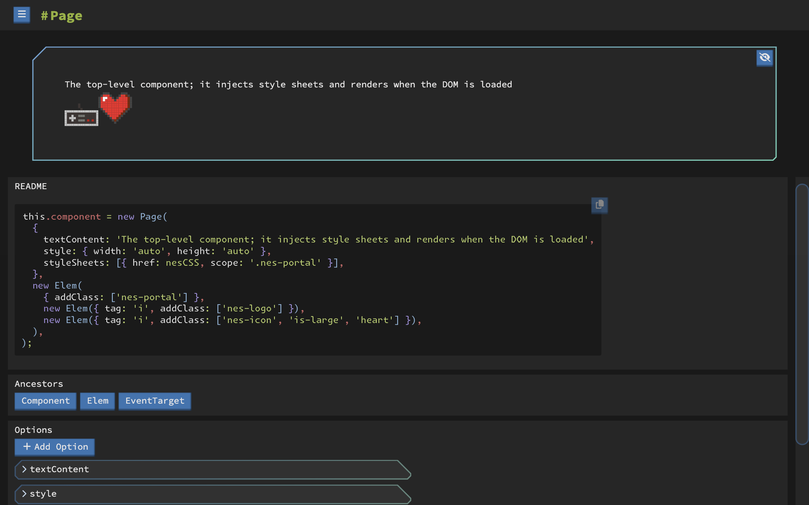

# vanilla-bean-components

> Class based JS components. A pattern focused on improving frontend development experience utilizing a component concept.

- A Proxy-based observable state utility
- A fetch-based API request/mutation utility with cache & subscriptions
- A runtime, hydrate-able, CSS in JS solution that leverages postcss
- A Class interface wrapping an HTMLElement, with observable state, and a handful of common utilities for interaction and manipulation
- A bunch of re-usable Components for common UI patterns
- A demo server with a suite of demos and examples to illustrate the usage and benefits of the pattern

This library is comprised of 6 major pieces:

- [Context](./context/README.md)
- [Request](./request/README.md)
- [Elem](./Elem/README.md)
- [Component](./Component/README.md)
- [Theme](./theme/README.md)
- [Styled](./styled/README.md)

## Usage

`npm install github:fatlard1993/vanilla-bean-components`

```js
import { Page } from 'vanilla-bean-components';

new Page({ appendTo: document.body, content: 'Hello World' });
```

All [components](./demo/components) maintain a README, demo, and test which offer good examples of how each component can be used. Additionally, there are a set of [examples](./demo/examples) available for reference.

> Read the [Getting Started](./docs/GETTING_STARTED.md) doc when you're ready to start your own project with vanilla-bean-components.

### Demo

The [demo app](./demo/README.md) is built on bun and vanilla-bean-components which serves a second purpose as its own full-stack, eating your own dog food, example.

`bun start`



## Disclaimer

> This is a personal project and is currently under active development, everything is subject to change. Its current state reflects my current opinions as much as time allows within the confines of work and life responsibilities.

This repo can be re-themed, and extended as-is. But another great way to leverage this pattern is to clone/fork this repo and own it, completely cut/replace/rebuild components and theme to fit your exact needs, build your own component library, or even implement the pattern directly in your app.

### Goal

Prove that scalable, reactive component patterns like the ones promoted within frameworks like React/Angular/Vue/Svelte/Etc can be achieved with a development pattern and little to no dependencies.

Projects with similar goals or results:

- [ArrowJS](https://github.com/justin-schroeder/arrow-js)
- [HTMX](https://github.com/bigskysoftware/htmx)
- [VanJS](https://github.com/vanjs-org/van)
- [RawJS](https://github.com/squaresapp/rawjs)
- [Alpine.js](https://github.com/alpinejs/alpine)
- [uHTML](https://github.com/WebReflection/uhtml)

### My Opinions

> Obviously my personal experience and use-cases color my opinion, which in turn results in deviation from the paths others have forged. Those working opinions are [here](./docs/ETHOS.md) if you're interested.

Library justifications:

- [@ctrl/tinycolor](https://github.com/scttcper/tinycolor): Used for the colors in the theme
- [@fortawesome/fontawesome-free](https://fontawesome.com/search): Used for all icons via the `icon` prop
- [augmented-ui](https://augmented-ui.com/): Used to create sci-fi boxes and borders
- [nanoid](https://github.com/ai/nanoid): Used to generate unique identifier strings for classes/ids/etc
- [postcss](https://github.com/postcss/postcss) / [postcss-nested](https://github.com/postcss/postcss-nested) / [autoprefixer](https://github.com/postcss/autoprefixer): Used to parse css strings for `styled()` and `Component.styles()`
