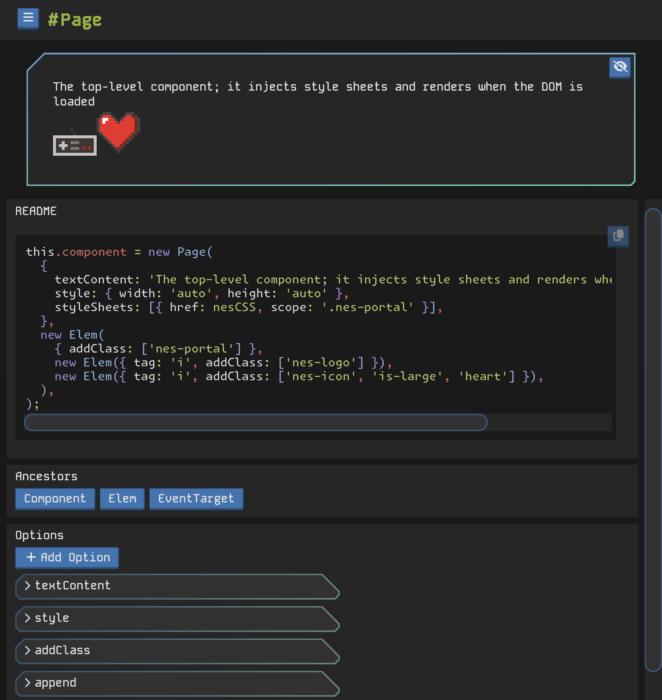

# Demo Server

The demo server is intended to provide a storybook-like experience for evaluating and referencing component features, props, and behaviors.

## Start

`bun run demo`

> The server is available @ [localhost:9999](http://localhost:9999)

## Development

The demo server is also capable of being run in "dev mode" with hot reloads making it a great place to work on the components.

`bun run dev`
